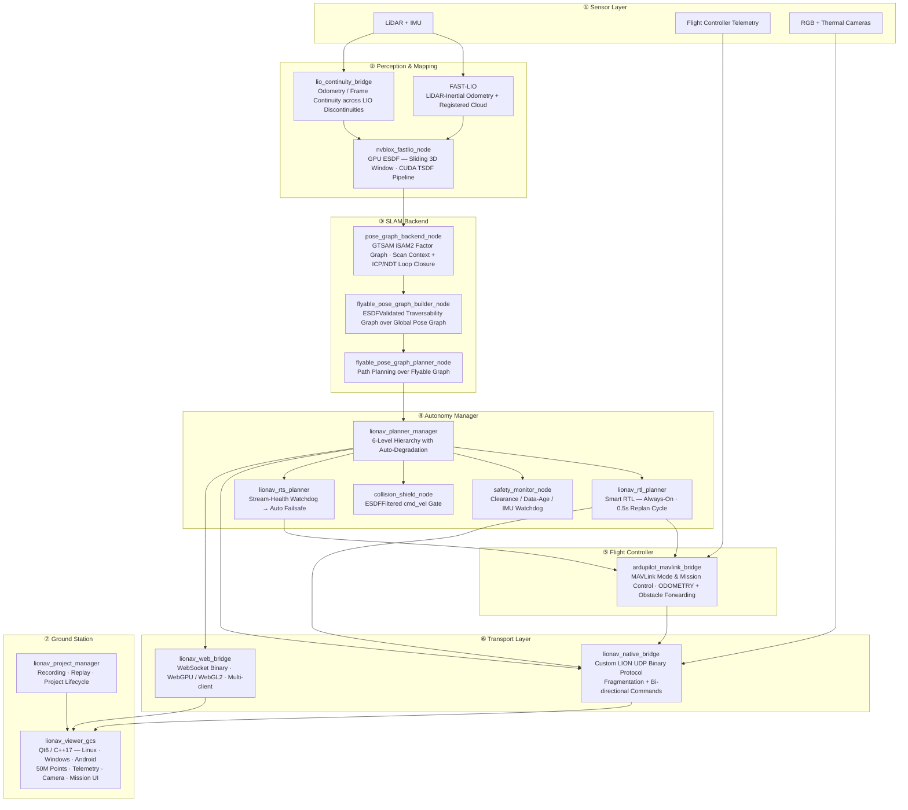
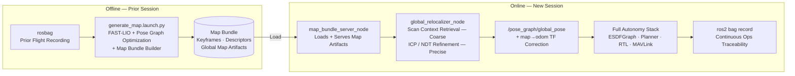
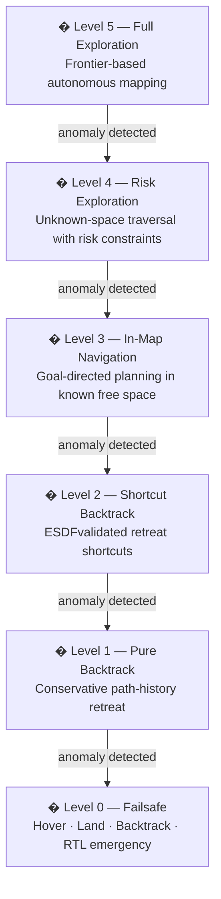
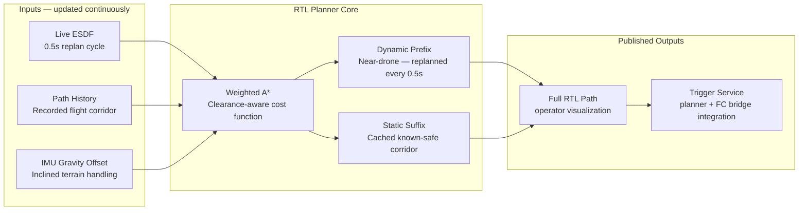
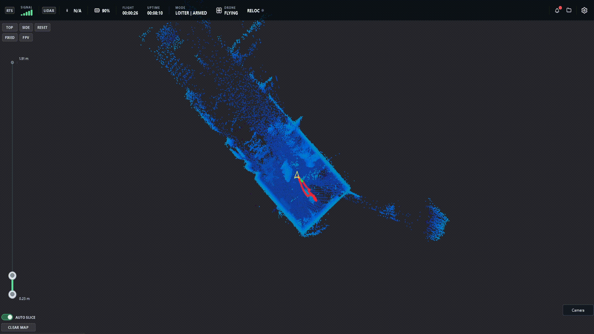
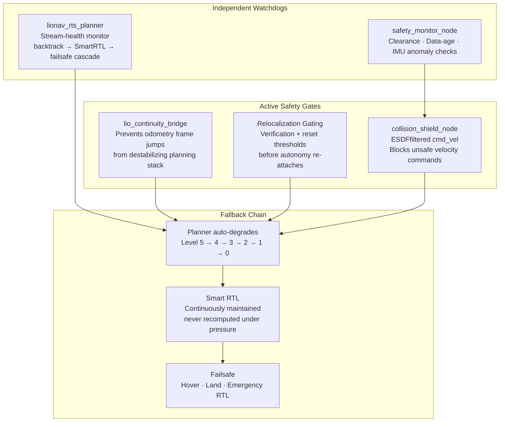
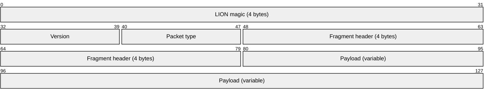

<div align="center">

<br/>

```
██╗     ██╗ ██████╗ ███╗   ██╗ █████╗ ██╗   ██╗
██║     ██║██╔═══██╗████╗  ██║██╔══██╗██║   ██║
██║     ██║██║   ██║██╔██╗ ██║███████║██║   ██║
██║     ██║██║   ██║██║╚██╗██║██╔══██║╚██╗ ██╔╝
███████╗██║╚██████╔╝██║ ╚████║██║  ██║ ╚████╔╝ 
╚══════╝╚═╝ ╚═════╝ ╚═╝  ╚═══╝╚═╝  ╚═╝  ╚═══╝  
```

### End-to-End Autonomous Drone Navigation Stack

**GPS-denied flight in caves, mines, tunnels, and high-risk industrial interiors**

<br/>


<br/>

> *This repository is intentionally documentation-only for IP and safety reasons.*  
> *The full implementation lives in a private repository.*  
> *This README reflects the actual architecture, interfaces, and deployed capabilities.*

<br/>

</div>

---

## What Is LIONav?

LIONav is a **production-grade, end-to-end autonomous drone flight stack** built for GPS-denied environments where off-the-shelf autopilots fail. It is not a research prototype or a stitched-together demo — it is a complete autonomy system engineered around failure modes, constrained edge hardware, degraded communications, and real-world repeat operations.

It was designed, architected, and implemented entirely by a single engineer, covering every layer:

> Sensor fusion → 3D mapping → SLAM → planning → safety → flight execution → comms protocol → ground control → mission data lifecycle

The system can fly autonomously through an unexplored cave with no GPS, build a 3D map in real time, maintain a continuously-valid escape route home, and return safely under communications blackout — all without operator intervention.

---

## System Architecture



---

## Three Core Pillars

### Pillar 1 — Autonomous Flight Stack (`flyable_autonomy.launch.py`)

The primary mission launch entrypoint. A single launch file that deterministically brings up the complete autonomy chain with runtime feature toggles per deployment profile.

**What it orchestrates:**

| Component | Role |
|---|---|
| `FAST-LIO` | Real-time LiDAR-inertial odometry; registered point cloud output |
| `lio_continuity_bridge` | Maintains odometry and frame continuity across LIO restarts or time gaps |
| `nvblox_fastlio_node` | GPU-accelerated local ESDF on a sliding 3D window (CUDA/TSDF pipeline) |
| `pose_graph_backend_node` | Global pose graph with GTSAM iSAM2; loop closure via Scan Context + ICP/NDT |
| `flyable_pose_graph_builder_node` | Builds ESDF-validated traversability graph over the global pose graph |
| `flyable_pose_graph_planner_node` | Path planning over the flyable graph |
| `lionav_planner_manager` | 6-level autonomy hierarchy with automatic degradation (see below) |
| `lionav_rtl_planner` | Always-on Smart RTL with continuous obstacle-aware replanning |
| `lionav_rts_planner` | Stream-health watchdog; auto-triggers backtrack/SmartRTL/failsafe on signal loss |
| `ardupilot_mavlink_bridge` | MAVLink mode and mission control, ODOMETRY integration, obstacle forwarding |
| `lionav_native_bridge` | Custom UDP binary transport to ground station |
| `lionav_web_bridge` | WebSocket binary bridge for browser-based operators |
| `lionav_project_manager` | Mission recording, replay, project lifecycle backend |

**Design intent:** Clear separation of perception, planning, control, transport, and ops tooling — composable, not monolithic.

---

### Pillar 2 — Multi-Session Relocalization (`relocate_and_fly.launch.py`)

Enables repeat inspections of the same site across separate sessions — a hard problem in GPS-denied SLAM. Rather than building a new map each flight, the drone loads a prior map bundle and localizes itself within it before resuming full autonomy.

**Relocalization pipeline:**



**Use cases:** Infrastructure inspection on repeat schedules, mining shaft re-entry, survey missions where previously mapped environments must be revisited without a ground truth reference.

---

### Pillar 3 — Cross-Platform Ground Station (`lionav_viewer_gcs`)

A purpose-built operator cockpit targeting Linux, Windows, and Android from a single C++/Qt codebase. Engineered for high-density real-time visualization under constrained hardware and poor network conditions.

| Capability | Detail |
|---|---|
| **Rendering** | Qt6 / C++17 with OpenGL; up to **50,000,000-point** accumulation buffer |
| **Live visualization** | Point cloud, odometry trajectory, planned path, Smart RTL path overlays |
| **Telemetry** | Battery, temperature, signal, mode, attitude, timing, flight state, GPS fix, status text |
| **Camera feeds** | RGB + thermal via RTSP / GStreamer / Qt Multimedia fallback; simultaneous dual feed |
| **Mission control** | Project browser, start/stop recording, replay with play/pause/stop/seek/speed |
| **Smart RTL trigger** | One-click trigger with safety confirmation — autonomy stack computes and executes obstacle-free path in real time |
| **Transport** | Custom `LION` binary protocol — not ROS, not MAVLink, not generic middleware |

---

## Autonomy Framework — 6-Level Hierarchy

`lionav_planner_manager` runs a structured hierarchy with **automatic degradation toward safer behavior** on any anomaly:



> Autonomy level can be set at launch time or commanded in flight via ROS services and actions.  
> Promotion to a higher level requires explicit clearance — degradation is always automatic.

---

## Smart Return-To-Launch — Always-On Escape Path

`lionav_rtl_planner` is **continuously running**, not activated on demand. It maintains a valid, obstacle-free path home at all times — so when it's needed, it's already computed.

**Real-time shortest return-to-launch path discovery:**




When the operator triggers Smart RTL from the GCS — or when the RTS watchdog detects sustained signal degradation — this path is **immediately executable**.

---

## Live Mapping

**Live mapping output: point cloud evolution, trajectory updates, and planner response:**



---

## Safety Architecture

Safety is woven into every layer — not added on top:



> **The system is designed to land safely, not crash safely.**

---

## Communication Protocol — `LION` Binary Protocol

The ground station uses a **custom binary protocol** designed from scratch — not ROS over the air, not MAVLink GCS extensions, not a generic UDP wrapper.

**Packet layout:**



**Why custom — not protobuf, not ROS2 DDS:**

| Concern | Solution |
|---|---|
| 50M-point cloud streaming | Binary packing; zero-copy fragmentation and reassembly at receiver |
| Packet loss resilience | Fragment header enables partial reassembly without full retransmit |
| Parsing overhead | No schema serialization — raw binary, receiver knows the layout |
| Control latency | Bi-directional command plane over the same socket; no separate channel |
| Constrained links | Per-client rate limiting and throttling baked into protocol design |

**Downlink streams:** point cloud · odometry trajectory · planned path · Smart RTL path · telemetry · autonomy status · safety status

**Uplink commands:** planner level · mission commands · failsafe/backtrack/exploration requests · FC execute/stop hooks · project manager controls · replay controls

The `lionav_web_bridge` exposes the same data model over WebSocket binary for browser clients with a WebGPU renderer (WebGL2 fallback) and per-client rate limiting.

---

## Technology Stack

| Layer | Technology |
|---|---|
| **Middleware** | ROS 2 Humble, `ament_cmake`, `colcon` |
| **Languages** | C++17 — core, GCS, bridges · Python 3 — launch, tooling |
| **Localization** | FAST-LIO — LiDAR-inertial odometry |
| **GPU Mapping** | NVIDIA nvblox — CUDA TSDF/ESDF |
| **SLAM Backend** | GTSAM iSAM2 · Scan Context · ICP + NDT loop closure |
| **Point Cloud** | PCL · Eigen |
| **Planning** | Custom flyable graph planner · 6-level autonomy manager · weighted A* RTL |
| **Flight Integration** | MAVLink / ArduPilot |
| **Ground Station** | Qt6 (Widgets, Network, Multimedia, OpenGL) · C++17 · OpenGL |
| **Web Client** | WebSocket · WebGPU · WebGL2 |
| **Transport** | Custom `LION` UDP binary protocol · WebSocket binary |
| **Build** | `colcon` · `ament` · `CMake` |

---

## Engineering Ownership

This is a solo engineering project. Every component was designed, architected, and implemented by one engineer:

| Domain | Scope |
|---|---|
| **System architecture** | Package decomposition, component boundaries, data flow design |
| **Launch orchestration** | Deterministic startup chains, feature toggles, deployment profiles |
| **Sensor fusion** | FAST-LIO integration, frame continuity bridge, IMU handling |
| **GPU mapping** | nvblox ESDF pipeline integration and sliding-window configuration |
| **SLAM backend** | Pose graph construction, loop closure pipeline, relocalization |
| **Planning** | Flyable graph construction, 6-level autonomy hierarchy, Smart RTL |
| **Safety systems** | Monitor watchdog, collision shield, RTS watchdog, failsafe chain |
| **Multi-session workflows** | Map bundle builder, relocalization gating, map server |
| **Protocol design** | LION binary protocol, fragmentation, bi-directional command plane |
| **Ground station** | Qt6 GCS, OpenGL renderer, 50M-point accumulation, telemetry UI, camera feeds, mission controls |
| **Web client** | WebSocket bridge, WebGPU/WebGL2 renderer, multi-client management |
| **Mission data lifecycle** | Project manager, recording pipeline, replay with seek/speed, metadata indexing |

---

## What Makes This Production-Relevant

Most autonomy stacks are built for demos. LIONav is built for operations:

- **Failure-first design** — every component has a degraded-mode behavior; nothing assumes nominal conditions
- **Edge compute** — runs on constrained onboard hardware; GPU mapping is bounded by sliding-window ESDF, not unbounded voxel growth
- **Comms-degraded ops** — Smart RTL is precomputed; RTS watchdog triggers autonomous return before comms fully drop
- **Repeat operations** — persistent map bundles and multi-session relocalization mean the map is an asset, not discarded after each flight
- **Operator observability** — telemetry, safety status, autonomy level, and path visualization are live at the ground station throughout the mission
- **Field data continuity** — chunked recording, metadata indexing, and replay mean every flight is reconstructible for review or analysis

---

## Repository Note

```
This repository contains documentation only.
The implementation is private for IP and safety reasons.
All architecture, interfaces, and capabilities described here
reflect the actual deployed system.
```

---

<div align="center">

*Built for the environments where other systems refuse to fly.*

</div>
